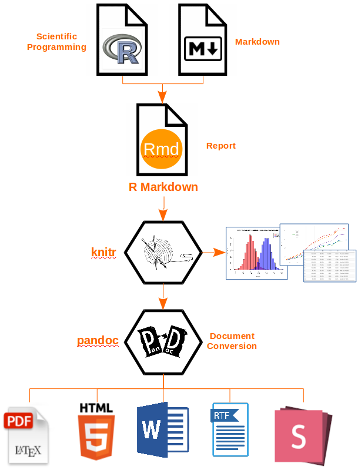

## Introduction

R Notebooks can be used to organize the methods that are used in a study
or even the result. That will make it reproducibility. R Notebooks can
help with reproducibility because the R Notebook also easily can be
shared between colleagues or partners who works with the same studies or
forexample are sharing an analyse. It is actually a great tool for
sharing an analyse or even a vizualtion. It can be used in many
different fields. An Example is if there is need for a statistical
analysis R would be to great tool to use.

In R there is a command that can run and reproducible document again
from start to it is finished, which is very important for a reproducible
document. In addition, it is easy to test the notebooks for
reproducibility.

Barbara R.Jasny writes in an article that as new technologies produce
more and different data to work with the knowledge [@jasny_again_2011]

## Definition

***R notebook*** "is an R Markdown document with chunks that can be
executed independently and interactively, with output visible
immediately beneath the input"@grolemund_r_nodate.

The terms reproducibility and replicability are used interchangeably in
scientific circles. Some groups believe that reproducibility means
repeating an investigation in an article using the same data, while
replicability means doing it again, preferably with new data, but
getting the same response. While other groups believe the opposite.

Regarding to K. Bollen et al. in the national Science Foundation the
definitions for reproducibility, replicability and generalization is
clear:

**Reproducibility** means that a researcher have the opportunity to use
the result of a prior study and repeat the research with the same data
and procedures that were used in the orginal study. For the find to be
credible and informative that reproducibility is a minimum necessary
condition. @bollen_social_2015

**Replicability** is when a researcher follows the same procedures as in
an earlier study and manages to get the same result, but by collecting
new data. @bollen_social_2015

**Generalizability** "refers to whether the result of a study apply in
other context or populations that differ from the original one"
@bollen_social_2015

### Picture

R Notebook with R Markdown

{width="361"}

## **Reproducibility**

If there is already a published article and there is a new scientist who
wants to make an analyse using the same data from that article it will
only be reproducibility if the new result is the same as in the already
published article. There is benefits and disadvantages with
reproducibility and that is important to look into. Some scientists have
also tried to find some solution to the issues with mixing up
reproducibility, replicability and generalizability, because the
scientific environment have different opinions about what means what.

When the scientists agree on the definitions of the various terms, the R
notebook can be a good help further. As previously mentioned, the R
notebook is a good tool when it comes to organizing methods or results
so that it is reproducible. Using the R notebook will also make the
study more efficient and easier to share analyzes with other colleagues
or other scientists.

### Benefits

As we have written about before, we use reproducibility to repeat a
research using the same data but with a separate twist.

Barbara R. Jasny et al. writes in an article that new technology is
constantly emerging, and produces new data in different variants, which
increases the expectations for new knowledge. [@jasny_again_2011]. By
increasing the expectations of the data, we can also see an increase in
the expectations for the content.

Although a test is reproducible, the quality may not be as good.

### Disadvantages

Steven N. Goodman et al. are writing in their article that
reproducibility, replicability, reliability, robustness, and
generalizability are used interchangeably in, for example, scientific
environments. The terms seem to be a confusion in the literature and it
can make it difficult to rely on a scientific result For their part, it
is mostly for use in the biomedical field, but there is great faith that
this could also solve other scientific areas.\@goodman_what_2016.

An example: Some groups believes reproducibility means repeating an
investigation in an article using the same data, and replicability means
doing it again, preferably with new data, but getting the same response.
While other groups believe the opposite.

There is also another minus with reproducibility and that is that the
result you have obtained can be built on by others who in turn can use
it to develop new ideas or other methods. It may lead to further errors
if the article was initially incorrect.

#### Solution

First of all, a solution could be that the scientific environment came
together to create and definition to each of the different concepts
reproducibility, replicability, reliability, robustness, and
generalizability. It would have made the concepts easier to use and
which in turn had given a common understanding of what was used at any
given time. Steven N. Goodman et al. want to divide it into three
different elements: methods reproducibility, results reproducibility,
and inferential repro- ducibility. For their part, it is mostly for use
in the biomedical field, but there is great faith that this could also
solve other scientific areas @goodman_what_2016.

Bollen et al. says that scientists should document all the information
in the procedures they use when collecting data - right down to the
level of detail. It will make it easier and more effective for
researchers who comes after using the same report and get the same
results as the original researchers. It will not only reproduce
reproducibility, but they will also be able to provide more information
@bollen_social_2015.

#### Is there a perfect code?

Nick Barnes who works in the Climate Code Foundation writes in an
article from 2010, that researchers don't have to put so much emphasis
on coding in their work, because the benefit of sharing raw data can be
greater than writing a perfect code.

He further writes that if we share raw data that performs the job it is
supposed to, the intention with the data is in place. So why not share
it then.

He points out that in 2007 NASA released a software that wasn't
completely finished, but by releasing it before it was completely
finished, they received held along the way so that it became both better
and more user-friendly. Even if they got help, it didn't mean that NASA
had released a bad program or that the result after they released the
first version gave a slightly worse result. NASA took the change with
them and made the software even better.

In Conclusion, he writes that researchers must work together to create
space to release raw data, so that we can benefit from each other's help
to not always strive for perfectionism before we publish. But this is
not something researchers need to do alone they also need help from the
community around them [@barnes_publish_2010].

#### *Referances*

::: {#refs}
:::

#### **Appendix**

rmarkdown_workflow.png

Roger Peng.PNG
